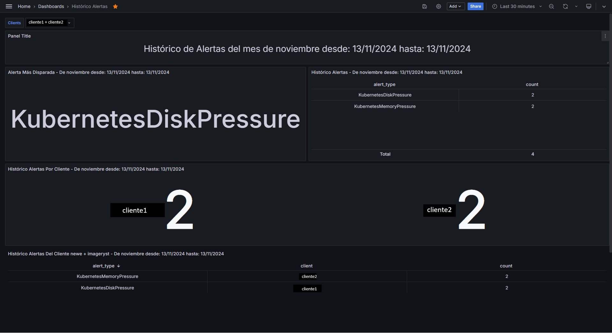
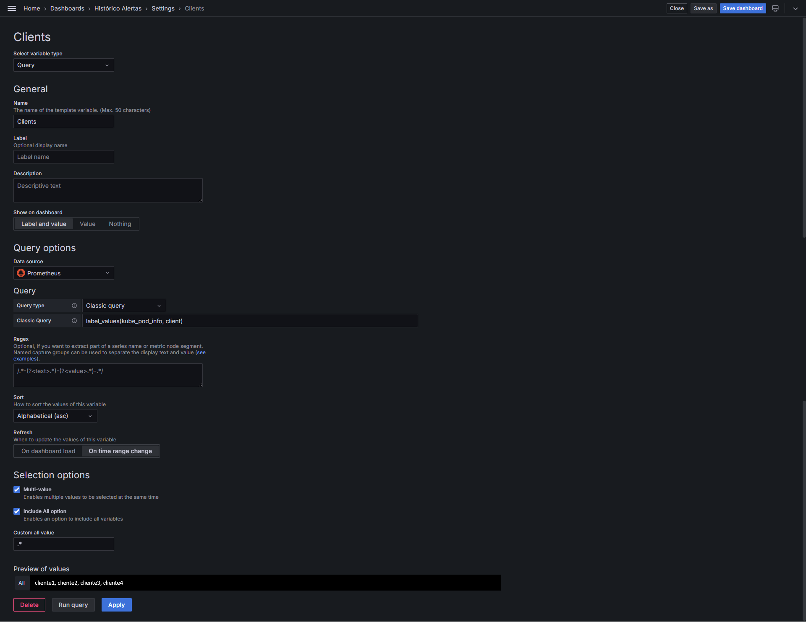
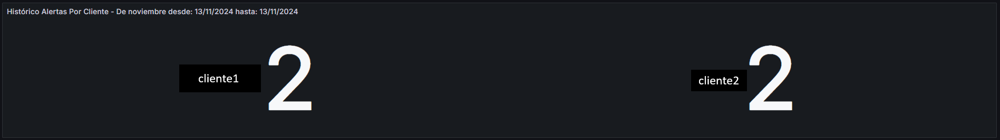

# Panel Histórico de alertas
Este documento detalla las consultas para las alertas que se muestran en el panel **Histórico de Alertas**. El propósito es proporcionar una explicación de cómo se obtiene y se presenta la información de las alertas. Gracias a esta guía podrás entender como están creadas cada consulta.
## Índice
- [Creación de la variable clients](#creación-de-la-variable-clients)
- [Variables internas de Grafana](#variables-internas-de-grafana)
- [Paneles](#paneles)
  - [Alerta más disparada](#alerta-más-disparada)
  - [Alertas sin importar el cliente](#alertas-sin-importar-el-cliente)
  - [Alertas por cliente](#alertas-por-cliente)
  - [Conteo de alertas por cliente](#conteo-de-alertas-por-cliente)
  - [Histórico alertas detallado](#histórico-alertas-detallado)



## Creación de la variable clients
Se crea esta variable para que algunos paneles sean dinámicos. Se utiliza la expresión regular **(.*) == "all"** para tener una lista de todos los clientes. Ten presente esto, ya que nos será de utilidad en el panel *"Histórico de alertas del cliente"*.



## Variables internas de Grafana
Se utilizan dos variables que son internas de Grafana. Son los rangos de fechas, gracias a estos podemos obtener las métricas entre esos rangos de tiempos.

* **__from:** Fecha de inicio. Le damos un formato para extraer de esa fecha solo los valores que queremos.
* **__to:** Fecha fin. Le damos un formato para extraer de esas fechas solo los valores que queremos. Gracias a estos enlaces pude encontrarlas, configurarlas y darles el formato necesario:
  [Añadir variables](https://grafana.com/docs/grafana/latest/dashboards/variables/add-template-variables/#__from-and-__to),
  [Variables de Fechas](https://momentjs.com/docs/#/displaying/)

## Paneles

### Alerta más disparada
Con este panel obtenemos la alerta más frecuente en un rango de tiempo específico. Sin importar el cliente.


#### Consulta a la base de datos influxdb
```text
from(bucket: "prometheus_alerts")
  |> range(start: v.timeRangeStart, stop: v.timeRangeStop)
  |> filter(fn: (r) => r.container != "unknown")
  |> filter(fn: (r) => r._field == "alertname")
  |> group()
  |> rename(columns: {_value: "alert_type"})
  |> keep(columns: ["alert_type"])
  |> group(columns: ["alert_type"])
  |> map(fn: (r) => ({ r with count: 1 }))
  |> sum(column: "count")
  |> group()
  |> sort(columns: ["count"], desc:true)
  |> limit(n: 1)
```
**Explicación de la consulta**

```from(bucket: "prometheus_alerts")``` → todas las consultas estarán haciendo consultas a este bucket.  

```|> range(start: v.timeRangeStart, stop: v.timeRangeStop)``` → variables internas de influxdb para hacer consultas dinámicas (recoge los valores de __from y __to).  Filtra los datos para que solo incluyan los que se encuentran dentro del rango de tiempo especificado.

```|> filter(fn: (r) => r.container != "unknown")``` → excluye los registros donde el valor de la columna container es “unknown“.

```|> filter(fn: (r) => r._field == "alertname")``` → filtra los datos para incluir solo los registros cuyo campo __field es “alertname“.

```|> group()``` → agrupa los datos en una sola tabla para los siguientes pasos.

```|> rename(columns: {_value: "alert_type"})``` → renombra la columna **_value** a **alert_type** para hacerlo más comprensible.

```|> keep(columns: ["alert_type"])``` → mantiene solo la columna **alert_type**, descartando las demás.

```|> group(columns: ["alert_type"])``` → agrupa los registros por el tipo de alerta **(alert_type)**

```|> map(fn: (r) => ({ r with count: 1 }))``` → agrega una columna de nombre **count** con el valor 1 por defecto en cada registro. Se usará para contar el número de ocurrencias.

```|> sum(column: "count")``` → suma los valores de la columna **count** para cada grupo, calculando el total de alertas por tipo.

```|> group()``` → elimina el agrupamiento anterior para ordenarlos.

```|> sort(columns: ["count"], desc:true)``` → ordena los resultados por la columna count en orden descendente, de modo que la alerta más repetida irá al principio.

```|> limit(n: 1)``` → limita los resultados, para solo mostrar la primera alerta, que será la más frecuente.

### Alertas sin importar el cliente
Consulta que devuelve el número de veces que se ha disparado cada tipo de alerta en un período de tiempo específico. 


#### Consulta a la base de datos influxdb
```text
from(bucket: "prometheus_alerts")
  |> range(start: v.timeRangeStart, stop: v.timeRangeStop)
  |> filter(fn: (r) => r.container != "unknown")
  |> filter(fn: (r) => r._field == "alertname")
  |> group()
  |> rename(columns: {_value: "alert_type"})
  |> keep(columns: ["alert_type"])
  |> group(columns: ["alert_type"])
  |> map(fn: (r) => ({ r with count: 1 }))
  |> sum(column: "count")
  |> group()
```

Esta consulta es iguala la consulta anterior **Alerta más disparada**, con excepción que no utilizamos **sort()** ni **limit()**.

Esta consulta devuelve una tabla con dos columnas: **alert_type** y **count**. Cada fila representa un tipo de alerta y el número de veces que se ha disparado en el rango de tiempo seleccionado.

### Alertas por cliente
Cuenta el número total de alertas disparadas, agrupadas por cliente, en un período de tiempo específico.



```text
from(bucket: "prometheus_alerts")
  |> range(start: v.timeRangeStart, stop: v.timeRangeStop)
  |> filter(fn: (r) => r.container != "unknown")
  |> filter(fn: (r) => r._field == "alertname")
  |> group()
  |> rename(columns: {_value: "alert_type"})
  |> keep(columns: ["alert_type", "client"])
  |> group(columns: ["client"])
  |> map(fn: (r) => ({ r with count: 1 }))
  |> sum(column: "count")
  |> group(columns: ["client"])
  |> group()
```

La alerta es igual a las anteriores. La única diferencia es que se agrega por la columna **client**.

### Conteo de alertas por cliente

Cuenta el número de veces que se han disparado alertas por cliente y tipo, permitiendo la selección de un cliente específico o de todos los clientes mediante una variable de Grafana.


```text
from(bucket: "prometheus_alerts")
  |> range(start: v.timeRangeStart, stop: v.timeRangeStop)
  |> filter(fn: (r) => r.container != "unknown")
  |> filter(fn: (r) => r._field == "alertname")
  |> filter(fn: (r) => "${Clients:regex}" == ".*" or r.client =~ /${Clients:regex}/) // Expresion regular (.*)
  |> rename(columns: {_value: "alert_type"})
  |> keep(columns: ["alert_type", "client"])
  |> group(columns: ["client", "alert_type"])
  |> map(fn: (r) => ({r with count: 1}))
  |> sum(column: "count")
  |> group(columns: ["client", "alert_type"])
  |> group()
```

**Explicación de consulta**

Vamos a explicar las partes más importantes de esta consulta (ya que los demás han sido explicadas en las anteriores consultas).

```|> filter(fn: (r) => "${Clients:regex}" == ".*" or r.client =~ /${Clients:regex}/)``` → este filtro hace que la consulta sea dinámica en función de la variable Clients de Grafana.

```"${Clients:regex}" == ".*"``` → verifica si la variable Clients es igual a (.*), lo que indica que se ha seleccionado la opción “All“ en la variable de Grafana. Si es true, todos los registros pasan el filtro. 

```r.client =~ /${Clients:regex}/``` → si la variable Clients no es (.*), se evalúa esta parte, que compara los registros con el cliente seleccionado en Grafana usando una expresión regular. Solo si los registros cuyo campo client coincida con la expresión regular.

Esta consulta devuelve una tabla con las columnas **client, alert_type y count**, donde cada fila representa un cliente y un tipo de alerta junto con el número de veces que dicha alerta se ha disparado en el periodo de tiempo especificado. La lógica del filtro con la variable **${client:regex}** permite que la consulta sea dinámica y que se pueda utilizar tanto de un cliente específico como para todos los clientes según la selección de la variable en Grafana.

### Histórico alertas detallado


```text
from(bucket: "prometheus_alerts")
  |> range(start: v.timeRangeStart, stop: v.timeRangeStop)
  |> filter(fn: (r) => r.container != "unknown")
  |> filter(fn: (r) => r._field == "alertname")
  |> filter(fn: (r) => r.severity == "critical" or r.severity == "warning") //filtra por ambos tipos de alertas
  |> filter(fn: (r) => "${Clients:regex}" == ".*" or r.client =~ /${Clients:regex}/) // Expresión regular (.*)
  |> keep(columns: ["_value", "category", "client", "namespace", "pod", "severity"])
  |> group(columns: ["_value", "client","severity","pod", "namespace"]) // Agrupar por estas columnas clave
  |> map(fn: (r) => ({r with count: 1})) // Añadir la columna "count" con valor 1
  |> sum(column: "count") // Sumar el conteo para cada grupo
  |> rename(columns: { "count": "alert_count" , "_value": "alert"}) // Renombrar la columna de conteo para claridad
  |> group() // Agrupar para presentación
```

**Explicación de consulta**
Esta consulta es similar a la consulta [Conteo de alertas por cliente](#conteo-de-alertas-por-cliente), realizando unos pequeños cambios descritos a continuación para mostrar más detallada la alerta:

```|> filter(fn: (r) => r.severity == "critical" or r.severity == "warning")``` → filtra las alertas con severidad **"critical"** o **"warning"**.

```|> keep(columns: ["_value", "category", "client", "namespace", "pod", "severity"])``` → mantiene más columnas para realizar una análisis más detallado.

```|> group(columns: ["_value", "client","severity","pod", "namespace"])``` → agrupa por más columnas.

```|> rename(columns: { "count": "alert_count" , "_value": "alert"})``` → renombra **_value** a **alert** y **count** a **alert_count**.